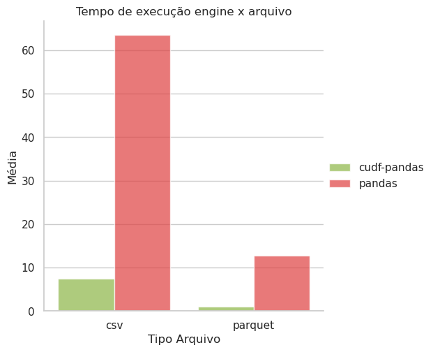

# Benchmark RAPIDS

Objetivo deste projeto é realizar testes com diferentes engines de processamento de dados em **Python**, comparando suas performances em relação ao tempo de execução.

## Setup

Máquina
- Processandor: Ryzen 9 7900
- Memória RAM: 64G
- Placa de Vídeo: RTX 4080 Super ProArt (16G)

Ambiente
- Python: 3.12.8
- RAPIDS: 24.12
- Cuda: 12.4
- NVidia Driver: 550.120

- Arquivos para leitura:
    - csv     (8,2G / 81.672.501 de linhas)
    - parquet (3,4G / 81.672.501 de linhas)

## Método

### Testes
- pandas
- cudf.pandas

### Passos
1. Ler arquivo;
2. Realizar `groupby` da chave primária contando linhas;

### Análise

Foram executadas 12 medições de tempo de execução para cara configuração, sem concorrência entre as execuções.

Após a apuração dos valores, para cada experimento, removemos o maior e menor tempo, considerando os demais 10 valores.

Assim, calculamos a média, mediana e desvio padrão:

Isto é:

|Tipo Engine   | Tipo Arquivo   |   Média |   Desvio Padrão |   Mediana |    Rate |
|:------------:|:--------------:|--------:|----------------:|----------:|--------:|
|cudf-pandas   | parquet        |  1.0649 |          0.0058 |    1.0630 |  1.0000 |
|cudf-pandas   | csv            |  7.4592 |          0.0058 |    7.4590 |  7.0045 |
|pandas        | parquet        | 12.7809 |          0.2217 |   12.7336 | 12.0018 |
|pandas        | csv            | 63.5371 |          1.6020 |   63.7970 | 59.6640 |

## Considerações Finais

Percebe-se um ganho expressivo de performance ao se utilizar o processamento na GPU. Isso e observado tanto na leitura de `csv`, quando `parquet`, em que este último se destaca ainda mais.

Outro detalhe importante de se destacar, é o desvio padrão que se observou nas execuções do `pandas` com o arquivo `csv`.

## Próximos passos

Adicionar novas engines de processamento, como:
- duckdb
- polars
- Apache Spark